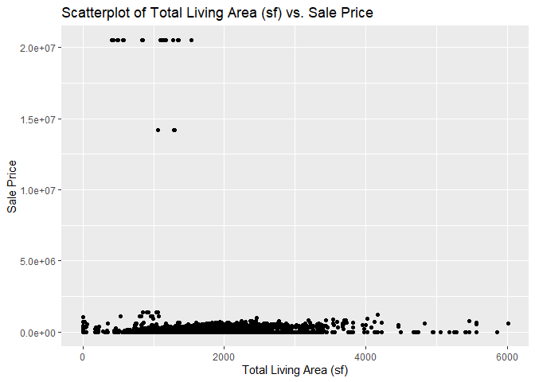

<!-- README.md is generated from README.Rmd. Please edit the README.Rmd file -->

# Lab report \#1

Follow the instructions posted at
<https://ds202-at-isu.github.io/labs.html> for the lab assignment. The
work is meant to be finished during the lab time, but you have time
until Monday evening to polish things.

Include your answers in this document (Rmd file). Make sure that it
knits properly (into the md file). Upload both the Rmd and the md file
to your repository.

All submissions to the github repo will be automatically uploaded for
grading once the due date is passed. Submit a link to your repository on
Canvas (only one submission per team) to signal to the instructors that
you are done with your submission.

## Step 1

Inspect first few lines of dataset:

``` r
library(classdata)
library(ggplot2)
head(ames)
```

    ## # A tibble: 6 × 16
    ##   `Parcel ID` Address      Style Occupancy `Sale Date` `Sale Price` `Multi Sale`
    ##   <chr>       <chr>        <fct> <fct>     <date>             <dbl> <chr>       
    ## 1 0903202160  1024 RIDGEW… 1 1/… Single-F… 2022-08-12        181900 <NA>        
    ## 2 0907428215  4503 TWAIN … 1 St… Condomin… 2022-08-04        127100 <NA>        
    ## 3 0909428070  2030 MCCART… 1 St… Single-F… 2022-08-15             0 <NA>        
    ## 4 0923203160  3404 EMERAL… 1 St… Townhouse 2022-08-09        245000 <NA>        
    ## 5 0520440010  4507 EVERES… <NA>  <NA>      2022-08-03        449664 <NA>        
    ## 6 0907275030  4512 HEMING… 2 St… Single-F… 2022-08-16        368000 <NA>        
    ## # ℹ 9 more variables: YearBuilt <dbl>, Acres <dbl>,
    ## #   `TotalLivingArea (sf)` <dbl>, Bedrooms <dbl>,
    ## #   `FinishedBsmtArea (sf)` <dbl>, `LotArea(sf)` <dbl>, AC <chr>,
    ## #   FirePlace <chr>, Neighborhood <fct>

The different variables are Parcel ID, Address, Style, Occupancy, Sale
Date, Sale Price, Multi Sale (if the sale was a package deal), Year
Built, Acres, TotalLivingArea (sf), Bedrooms, FinishedBsmtArea (sf),
LotArea (sf), AC (if the property has AC), FirePlace (if the property
has a fireplace), and Neighborhood.

The type of variable and their data range can be pictured with
summary(ames):

``` r
summary(ames)
```

    ##   Parcel ID           Address                        Style     
    ##  Length:6935        Length:6935        1 Story Frame    :3732  
    ##  Class :character   Class :character   2 Story Frame    :1456  
    ##  Mode  :character   Mode  :character   1 1/2 Story Frame: 711  
    ##                                        Split Level Frame: 215  
    ##                                        Split Foyer Frame: 156  
    ##                                        (Other)          : 218  
    ##                                        NA's             : 447  
    ##                           Occupancy      Sale Date            Sale Price      
    ##  Condominium                   : 711   Min.   :2017-07-03   Min.   :       0  
    ##  Single-Family / Owner Occupied:4711   1st Qu.:2019-03-27   1st Qu.:       0  
    ##  Townhouse                     : 745   Median :2020-09-22   Median :  170900  
    ##  Two-Family Conversion         : 139   Mean   :2020-06-14   Mean   : 1017479  
    ##  Two-Family Duplex             : 182   3rd Qu.:2021-10-14   3rd Qu.:  280000  
    ##  NA's                          : 447   Max.   :2022-08-31   Max.   :20500000  
    ##                                                                               
    ##   Multi Sale          YearBuilt        Acres         TotalLivingArea (sf)
    ##  Length:6935        Min.   :   0   Min.   : 0.0000   Min.   :   0        
    ##  Class :character   1st Qu.:1956   1st Qu.: 0.1502   1st Qu.:1095        
    ##  Mode  :character   Median :1978   Median : 0.2200   Median :1460        
    ##                     Mean   :1976   Mean   : 0.2631   Mean   :1507        
    ##                     3rd Qu.:2002   3rd Qu.: 0.2770   3rd Qu.:1792        
    ##                     Max.   :2022   Max.   :12.0120   Max.   :6007        
    ##                     NA's   :447    NA's   :89        NA's   :447         
    ##     Bedrooms      FinishedBsmtArea (sf)  LotArea(sf)          AC           
    ##  Min.   : 0.000   Min.   :  10.0        Min.   :     0   Length:6935       
    ##  1st Qu.: 3.000   1st Qu.: 474.0        1st Qu.:  6553   Class :character  
    ##  Median : 3.000   Median : 727.0        Median :  9575   Mode  :character  
    ##  Mean   : 3.299   Mean   : 776.7        Mean   : 11466                     
    ##  3rd Qu.: 4.000   3rd Qu.:1011.0        3rd Qu.: 12088                     
    ##  Max.   :10.000   Max.   :6496.0        Max.   :523228                     
    ##  NA's   :447      NA's   :2682          NA's   :89                         
    ##   FirePlace                            Neighborhood 
    ##  Length:6935        (27) Res: N Ames         : 854  
    ##  Class :character   (37) Res: College Creek  : 652  
    ##  Mode  :character   (57) Res: Investor Owned : 474  
    ##                     (29) Res: Old Town       : 469  
    ##                     (34) Res: Edwards        : 444  
    ##                     (19) Res: North Ridge Hei: 420  
    ##                     (Other)                  :3622

## Step 2

The variable of interest is Sale Price.

## Step 3

``` r
summary(ames$`Sale Price`)
```

    ##     Min.  1st Qu.   Median     Mean  3rd Qu.     Max. 
    ##        0        0   170900  1017479   280000 20500000

``` r
ggplot(ames, aes(x = `Sale Price`)) +
  geom_histogram(binwidth = 50000, fill = "skyblue", color = "black") +
  labs(title = "Histogram of Sale Price", x = "Sale Price", y = "Count")
```

<!-- -->

When we look at the summary() function we have:

Min. 0

1st Qu. 0

Median 170900

Mean 1017479

3rd Qu. 280000

Max. 20500000

This tells us that while most properties fall within a modest range,
there are some extreme values up to 20.5 million, and notably, a minimum
of 0, which is unusual for a sales price.

The histogram typically shows a right-skewed distribution. It means that
most properties are sold at lower prices.

A oddity is that the minimum sale price is 0, and the first quartile is
also 0. This suggests that a significant number of records have a sale
price of 0.

It might indicate data entry errors.

These could represent properties transferred without a sale.

## Step 4

Kylie: TotalLivingArea

``` r
ggplot(ames, aes(`TotalLivingArea (sf)`)) +
  geom_histogram(binwidth = 100, na.rm = TRUE)
```

<!-- -->

Lucas:

``` r
ggplot(ames, aes(x = `FinishedBsmtArea (sf)`)) +
  geom_histogram(binwidth = 100, fill = "lightgreen", color = "black") +
  labs(title = "Histogram of Finished Bsmt Area (sf)",
       x = "Finished Bsmt Area (sf)",
       y = "Count")
```

    ## Warning: Removed 2682 rows containing non-finite outside the scale range
    ## (`stat_bin()`).

<!-- -->

``` r
ggplot(ames, aes(x = `FinishedBsmtArea (sf)`, y = `Sale Price`)) +
  geom_point(alpha = 0.6, color = "steelblue") +
  labs(title = "Scatterplot of Sale Price vs. Finished Basement Area (sf)",
       x = "Finished Basement Area (sf)",
       y = "Sale Price")
```

    ## Warning: Removed 2682 rows containing missing values or values outside the scale range
    ## (`geom_point()`).

<!-- -->

Aiden:
